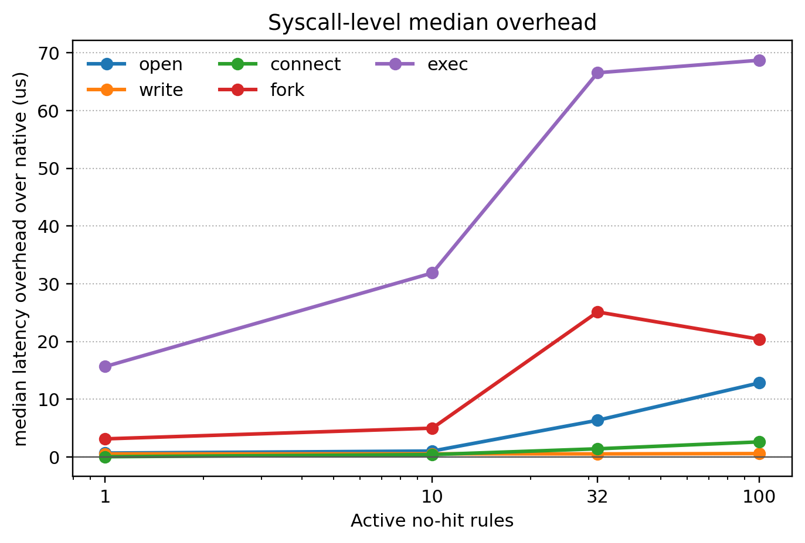
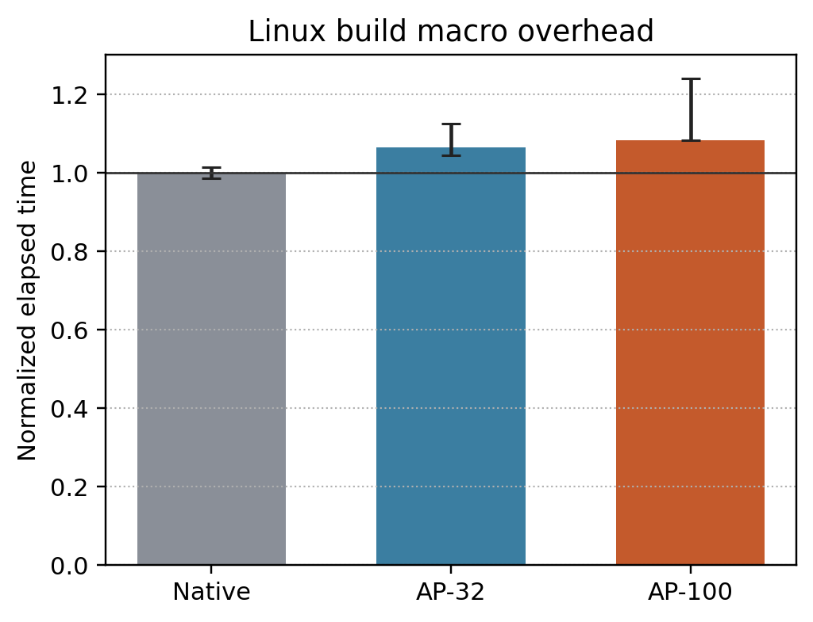
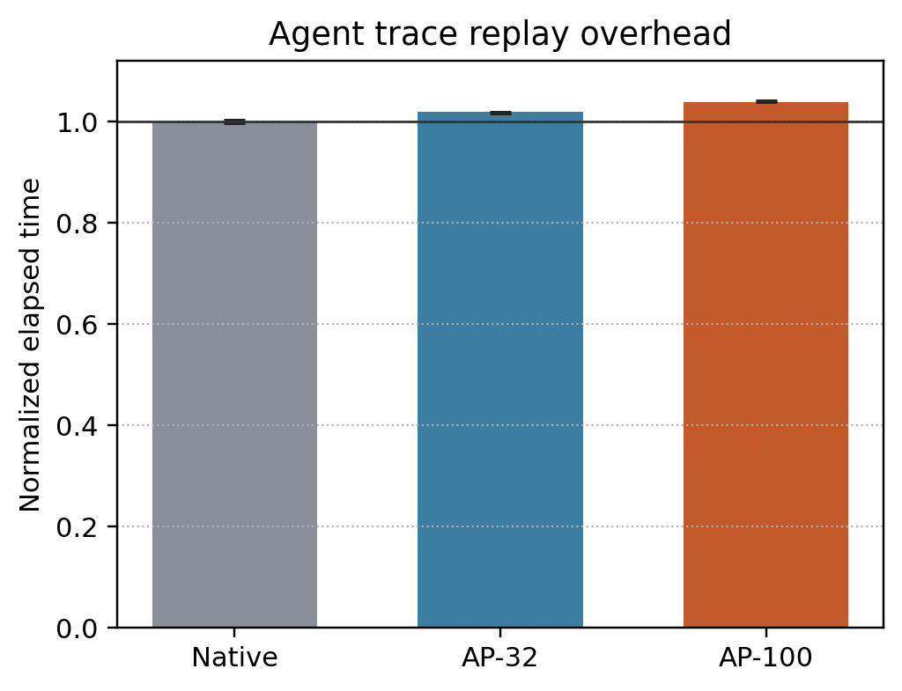

# RQ2: Runtime Overhead

This section evaluates ActPlane's runtime overhead at three levels: isolated
syscall paths, a standard systems macrobenchmark, and an end-to-end agent trace
replay. The goal is to separate per-hook cost from the slowdown visible to real
workloads.

## Experimental Setup

All experiments ran on a bare-metal Intel Core Ultra 9 285K machine with 24
hardware cores, Linux 6.15.11, and the CPU governor set to `performance`.
Microbenchmarks were pinned to CPU 2. Macrobenchmarks used all 24 cores.
Summary result artifacts are in:

- `docs/corpus-test/perf/results/rq2-micro-2026-06-02T-osdi`
- `docs/corpus-test/perf/results/rq2-macro-2026-06-02T-osdi-v2`

The tested configurations are:

- **Native:** no ActPlane wrapper.
- **AP-32:** ActPlane with 32 no-hit rules.
- **AP-100:** ActPlane with 100 no-hit rules.

The no-hit policies label the workload process tree with `source COMMAND = exec
"**"` and then install unreachable sink rules. This exercises label propagation
and rule scanning without including violation reporting, userspace formatting,
or corrective-feedback file writes. Those are different paths and should be
measured separately.

Important artifact caveat: `/sys/kernel/security/lsm` on this machine is
`lockdown,capability,landlock,yama,apparmor,ima,evm`; `bpf` is not active.
These are ActPlane harness/tracepoint-mode measurements. They are suitable for
engineering and paper-structure validation, but final camera-ready numbers
should be rerun on a kernel booted with BPF-LSM enabled.

## Workloads

**Syscall microbenchmarks.** We use a custom C benchmark to measure `open`,
`write`, UDP `connect`, `fork`, and `exec`. Each operation is repeated 10K to
100K times per trial, with 7 trials per configuration. We report the median
trial's p50 and p99 latency.

**Linux build macrobenchmark.** We exported a clean Linux 6.17 source tree from
the local `multikernel/linux-vanilla` checkout, then built `defconfig` +
`vmlinux` with `make -j24` in a fresh `O=` directory for every trial. We ran 3
trials per configuration and deleted build directories after each timed run.

**Agent trace replay.** We replayed the 20 corpus-derived traces in
`docs/corpus-test`: both compliant and violation variants. The deterministic
replayer executes Read/Write/Edit/Bash tool actions in temporary workspaces,
using stubs for project-local tools (`uv`, `pytest`, `git`) so the workload
does not depend on external package state. The trace suite contains 68 tool
actions, including 20 Bash subprocesses.

## Results

**Fig. RQ2a** shows median syscall latency overhead as the number of no-hit
rules increases. At AP-100, `open` adds 12.8 us at p50 and 14.7 us at p99.
`connect` adds 2.6 us at p50 and 2.9 us at p99. `write` has small absolute
cost, adding 0.57 us at p50 and 1.28 us at p99, but its relative overhead is
large because the native p99 is only 0.31 us. `fork` and `exec` include
scheduler and process-management cost; their p50 overhead at AP-100 is 20.4 us
and 68.7 us respectively, while their p99 values are noisier.

**Fig. RQ2b** shows normalized runtime for a full Linux `defconfig` + `vmlinux`
build. Native median runtime is 79.48 s. AP-32 increases runtime to 84.65 s
(+6.5%), and AP-100 to 86.18 s (+8.4%). The system-time component increases
from 201.4 s native to 213.5 s for AP-32 and 225.5 s for AP-100, consistent
with extra per-event kernel work being amortized across a large parallel build.

**Fig. RQ2c** shows overhead on the deterministic agent trace replay. Native
median runtime is 2.65 s. AP-32 takes 2.70 s (+1.9%), and AP-100 takes 2.75 s
(+3.8%). This workload is closer to the expected ActPlane deployment path than
Linux build: it includes tool-style file reads/writes, edits, and Bash
subprocesses, but avoids LLM latency so OS overhead is measurable.

## Summary

The main cost is on syscall-dense file-open paths: AP-100 increases `open` p99
by 14.7 us. End-to-end overhead is much smaller because real workloads amortize
that cost across CPU work, process setup, and tool execution. On this machine,
ActPlane adds 8.4% to a Linux build and 3.8% to deterministic agent trace
replay at 100 active no-hit rules.

For a final OSDI submission, this section should be rerun with BPF-LSM active,
macro trials should be randomized and increased to at least 5 repeats, and
matching `perf` tools should be installed to report cycles, instructions,
context switches, migrations, and page faults. The structure and artifacts here
match the systems-paper shape: isolated microbenchmarks, a standard Linux build
macrobenchmark, and an ActPlane-specific end-to-end agent workload.
